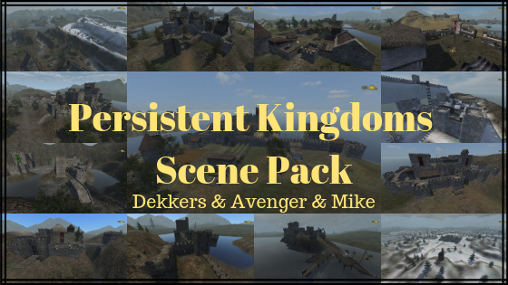

#### Persistent Kingdoms Scene Pack

  

## Introduction
The scenes presented here are a result of quite literally countless hours of scening, followed by countless hours of taking feedback, tweaking, bug-fixing, converting and optimising and have been the holy grail of the PW community for the past years. With the recent release of PK and the conversion of these scenes to the latest version we have decided to make them available for public use under a set of very specific terms that are designed to protect the work of these amazing sceners and nurture a culture that is acceptable to us and is in our opinion the only way forward.

PK scenes were made by [Dekkers](https://forums.taleworlds.com/index.php?action=profile;u=272189), [Avenger](https://forums.taleworlds.com/index.php?action=profile;u=92526) and [Mike](https://forums.taleworlds.com/index.php?action=profile;u=122959). 

We would also like to thank [Proton](https://forums.taleworlds.com/index.php?action=profile;u=442780) and Stefan who helped convert some of these scenes from PW to PK.

All of the scenes are ready to use with Persistent Kingdoms 1.2.

## License
The scenes can be used under the following terms:

**Persistent Kingdoms Servers:**
- You are free to use the scenes on your Persistent Kingdoms servers (not other modules).
- You are free to create derivative scenes and use them for your Persistent Kingdoms servers (not other modules). You may also distribute those creations for use in other Persistent Kingdom Servers. However, the terms presented here apply to any and all derivatives.
- No profit must be made using these scenes. If your server is taking donations that exclusively cover the server expenses you're free to use the scenes. Any other commercial venues are strictly forbidden.
- You must retain the original names of the scenes (even if you edit the scene yourself). Changing the scene names is not allowed.
- If your server is in any way breaking the TaleWorlds monetisation policy or breaking the modding guidelines described on the TaleWorlds forums you immediately lose the right to use the scenes and any scene derivatives.

**Server Hosts:**
- You are not allowed to in any way commercialize the scenes or use them to attract customers.

## Scene Information
The information for each scene, such as author and screenshots, can be found in the relevant folder.

## Contributing
If you wish to contribute then please get in contact with one of the PK developers via our [Discord Server](https://discord.gg/jwM54DB).

**Contributing Policy:**

For a contribution / pull request to be accepts the following must be done:
 * The changelog must be updated for each scene that is edited.
 * The old scene must be placed in a subfolder of the `Old Versions` folder with the date of when the scene was last edited as the name of the folder.
 * To combat abuse my mappers, for example where mappers in the past have placed hidden chests on the scene, the scene must be reviewed by a PK developer or someone they trust.
